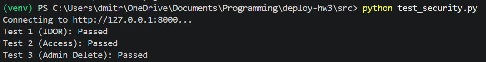
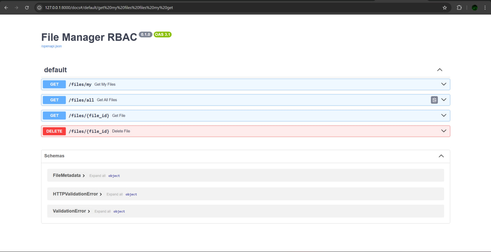
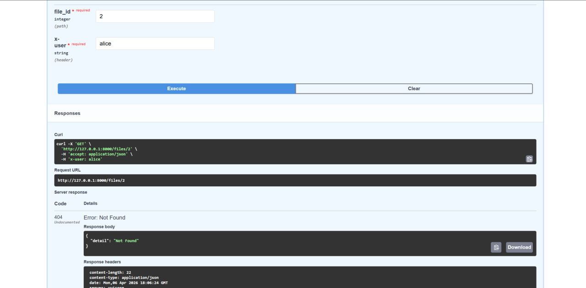
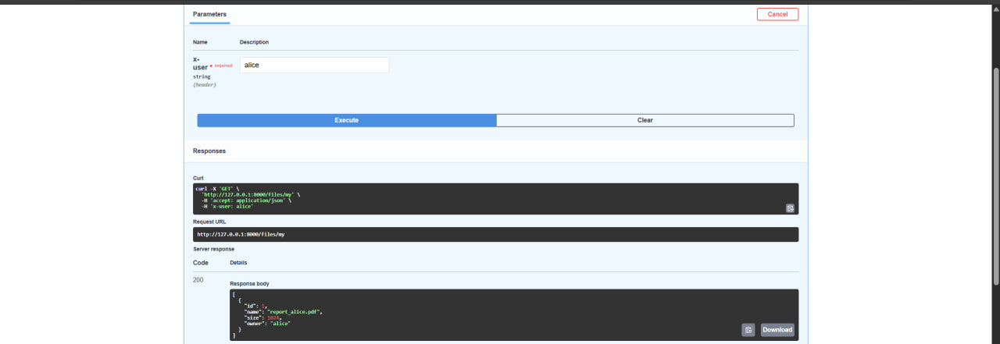
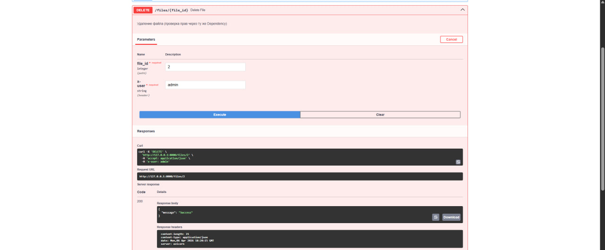

# Урок 8. Контроль доступа (IDOR и RBAC) в Корпоративном ПО

# 1. Результаты автоматизированного тестирования

# 2. Swagger UI

# 3. Закрытие дыры IDOR

# 4. Авторизованный доступ работает корректно

")

# 5. Подтверждение работы эндпоинта /files/my

# 6. Права администратора (RBAC)

