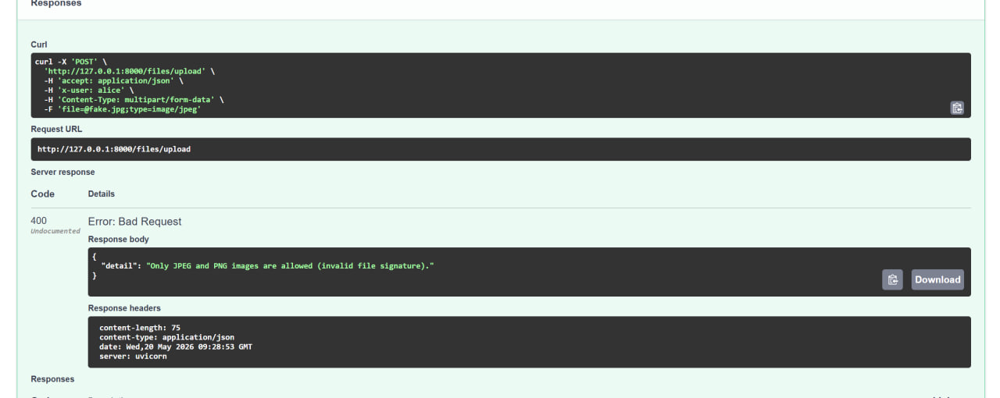
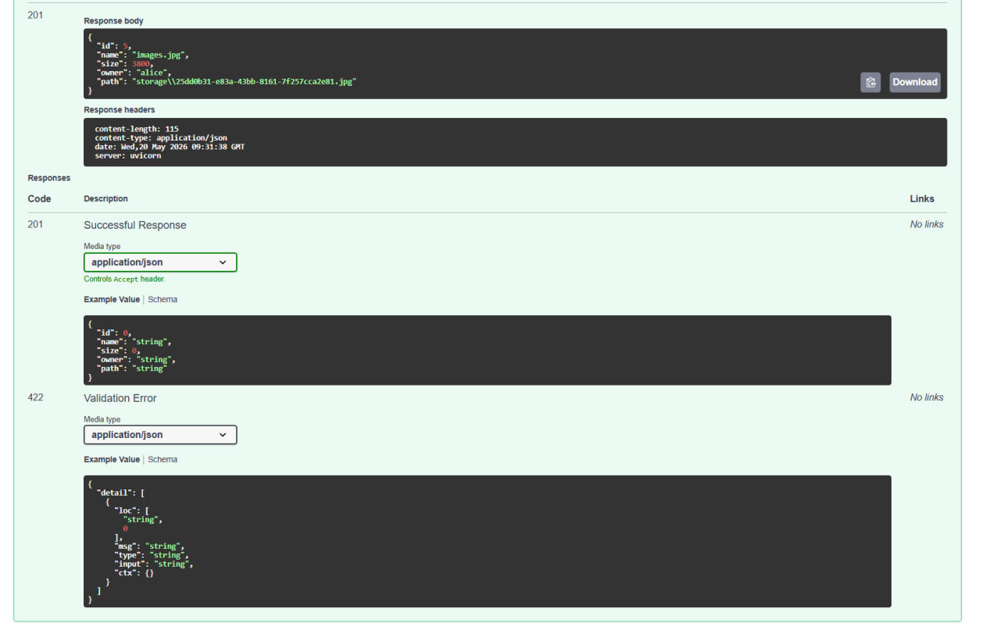
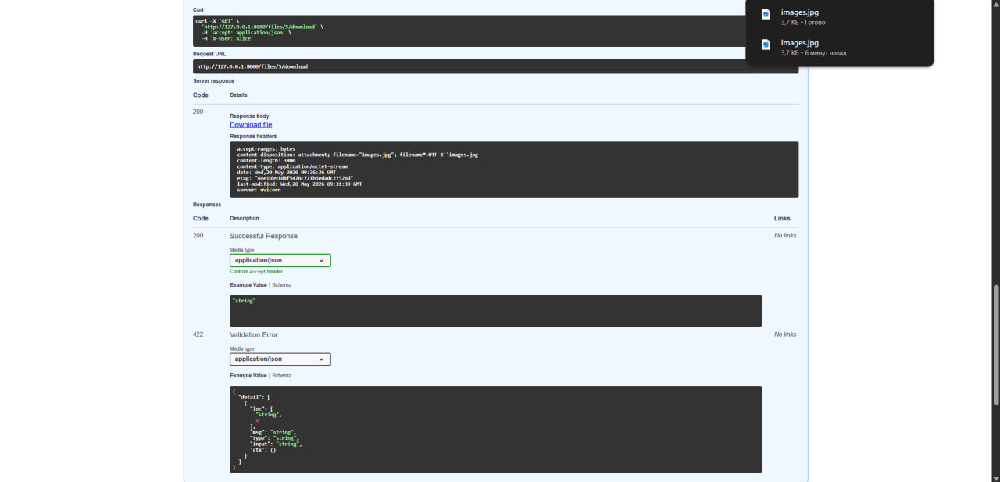

# HW Security №9 Безопасная работа с файлами

# 1. Скриншот папки storage, с UUID-именами.

# 2. Попытка загрузить fake photo.

# 3. Успешное скачивание оригинального файла через (GET/files/{file_id}/download)

